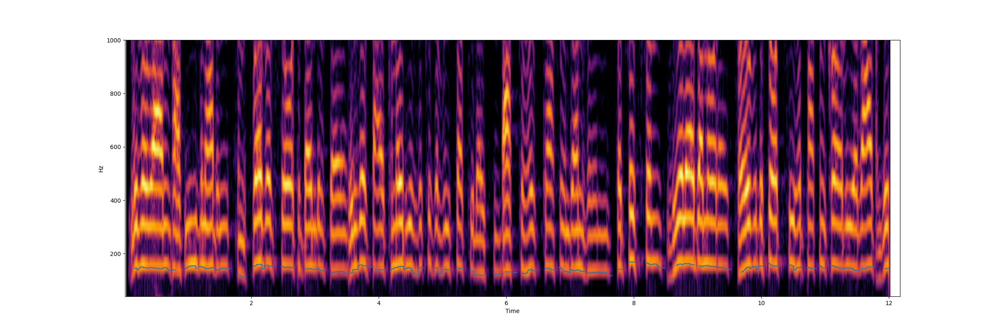

# pyinf0

## Abstract

fundamental (pitch) tracking using the probabilistic YIN method

## Description

The pYIN algorithm is a two-stage pitch tracking method that improves upon 
the conventional YIN algorithm by incorporating probabilistic analysis 
using a Hidden Markov Model (HMM) to produce smoother, more accurate predictions. 

1. Pitch Candidate Generation: Unlike the original YIN algorithm, 
  which outputs a single estimate per frame, pYIN generates 
  multiple potential candidates along with associated probabilities. 
2. HMM-based Pitch Tracking: The probabilities and candidates are used 
  as observations in a HMM. A Viterbi decoding process is then 
  applied to determine the most likely sequence of pitches, which results in the 
  improved pitch track. 

On this streaming version only past observations are taken into account. 
  
## Syntax


```csound
kfreq, kconfidence, kvoiced pyinf0 asig, iminfreq=60, imaxfreq=1000, ibufsize=2048, ioverlap=4, ktransprob=0.99, ibins=4, kdrift=5
```

## Arguments

* **asig**: audio signal
* **iminfreq**: min. frequency for f0 (default=60)
* **imaxfreq**: max. frequency for f0 (default=1000)
* **ibufsize**: size of the analysis frame (default=2048)
* **ioverlap**: overlapping frames. hopsize=bufsize/overlap (default=4)
* **ktransprob**: hmm transition probability (default=0.99)
* **ibins**: number of bins per semitone (default=4)
* **kdrift**: pitch drift between frames, in semitones (default=5)


## Output

* **kfreq**: detected frequency. Only valid if confidence is > ~0.4
* **kconfidence**: detection confidence
* **kvoiced**: is the sound voiced

## Execution Time

* Performance

## Examples


```csound


<CsoundSynthesizer>
<CsOptions>
-odac
</CsOptions>

<CsInstruments>
sr     = 44100
ksmps  = 64
nchnls = 2
0dbfs  = 1

/* example file for pyinf0

Syntax:

kfreq, kconfidence, kvoiced pyinf0 asig, iminfreq=60, imaxfreq=1000, ibufsize=2048, ioverlap=4, ktransprob=0.99, ibins=4, kdrift=5 

Args:
	* asig: audio signal
	* iminfreq: min. frequency for f0 (default=60)
	* imaxfreq: max. frequency for f0 (default=1000)
	* ibufsize: size of the analysis frame (default=2048)
	* ioverlap: overlapping frames. hopsize=bufsize/overlap (default=4)
	* ktransprob: hmm transition probability (default=0.99)
	* ibins: number of bins per semitone (default=4)
	* kdrift: pitch drift between frames, in semitones (default=5)

Output:
	* kfreq: detected frequency. Only valid if confidence is > ~0.4
	* kconfidence: detection confidence
	* kvoiced: is the sound voiced
	
*/


instr 1
  asig1 = oscili:a(0.5, 500)
  asig2 = diskin2("finnegan01.flac", 1, 0, 1)[0]
  asig3 = buzz(0.1, 300, 7, -1)
  asig4 = pinker() * 0.1
  Snames[] fillarray "sine", "speech", "buzz", "pink"
  ksource init 0
  if metro(1/3) == 1 then
    ksource = (ksource + 1) % 4
  endif
  asig = picksource(ksource, asig1, asig2, asig3, asig4)
  kpitch, kconf, kvoiced pyinf0 asig, 60, 1000, 2048, 8, 0.9, 5
  ksound = schmitt(dbamp(rms(asig)),  -45, -55);
  kenv = schmitt:k(kconf, 0.03, 0.01) * ksound;
  if metro(12) == 1 then
    printsk "Source: %d, %s, pitch: %f, conf: %f, voiced: %f, sound: %d\n", ksource, Snames[ksource], kpitch, kconf, kvoiced, ksound
  endif
  outch 1, asig
  outch 2, vco2(0.1, kpitch) * a(kenv)
endin

</CsInstruments>

<CsScore>
i1 1 20

</CsScore>
</CsoundSynthesizer>


```



[LISTEN](assets/pyin-test.mp3)

## See also

* [pyin](pyin.md)
* [ptrack](https://csound.com/docs/manual/ptrack.html)
* [plltrack](https://csound.com/docs/manual/plltrack.html)
* [pvsmagsum](pvsmagsum.md)
* [pvsflatness](pvsflatness.md)

## Metadata

* Author: Eduardo Moguillansky
* Year: 2026
* Plugin: else
* Source: https://github.com/csound-plugins/csound-plugins/blob/master/src/else/src/else.c
