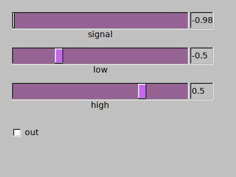

# schmitt

## Abstract

A schmitt trigger (a comparator with hysteresis). 


## Description

Implements a schmitt trigger, which is a comparator with hysteresis. Whenever the 
input is higher than `khigh`, output is 1 and stays 1 until input drops beneath
`klow`.

* Output is 1 if the input is higher than `khigh` if signal is increasing
* Output is 0 if the input is lower than `klow` if signal is decreasing

!!! Note 

    `schmitt` is particularly useful for implementing effects like a noise gate,
    to avoid fast opening and closing at the threshold. It can be further refined
    together with `lagud` to add attack / release times to the opening of the gate
    or with `trighold` to assure a minimum open time for the gate

Port of pd/else's `schmitt`

## Syntax

```csound

xout  schmitt xin, khigh, klow

```
    
### Arguments

* `xin`: input signal (k- or audio rate). The rate of `xin` must match the rate of `xout`
* `khigh`: high value of the comparator, output is 1 whenever input is higher than this
* `klow`: low value of the comparator, output is 0 whenever input is lower than this

### Output

* `xout`: output value of the comparator (0 or 1). Rate of xout is the same as xin

### Execution Time

* Performance (k or audio)

## Examples



```csound


<CsoundSynthesizer>
<CsOptions>
-odac           
</CsOptions>

<CsInstruments>
sr     = 44100
ksmps  = 64
nchnls = 2
0dbfs  = 1

/* Example file for schmitt opcode

	aout schmitt ain, khigh, klow
	kout schmitt kin, khigh, klow
	
	schmitt is a schmitt trigger (a gate with hysteresis), out is 1 if higher than khigh,
	0 if lower than klow

*/

FLpanel "schmitt", 400, 300, 50, 50
	idisp1 FLvalue "", 40, 30, 322, 20
	idisp2 FLvalue "", 40, 30, 322, 80
	idisp3 FLvalue "", 40, 30, 322, 140	
	FLcolor 150, 100, 150, 200, 100, 250
	gksignal, gih1 FLslider "signal", -1, 1, 0, 1, idisp1, 300, 30, 20, 20
	gklow,    gih2 FLslider "low",    -1, 1, 0, 3, idisp2, 300, 30, 20, 80
	gkhigh,   gih3 FLslider "high",   -1, 1, 0, 3, idisp3, 300, 30, 20, 140
	kschmitt, gih4 FLbutton "out",    1, 0, 3, 50, 50, 20, 200, -1
FLpanelEnd
FLrun

FLsetVal_i -0.5, gih2
FLsetVal_i 0.5, gih3

instr 1
	ain oscili 1, 0.25
	aout schmitt ain, gkhigh, gklow
	kguitrig metro 24
	FLsetVal kguitrig, k(ain), gih1
	FLsetVal kguitrig, k(aout), gih4	
endin

</CsInstruments>

<CsScore>
i1 0 100

</CsScore>
</CsoundSynthesizer>


```


## See also

* [lagud](https://csound.com/docs/manual/lagud.html)
* [trighold](https://csound.com/docs/manual/trighold.html)


## Credits

Eduardo Moguillansky, 2019
