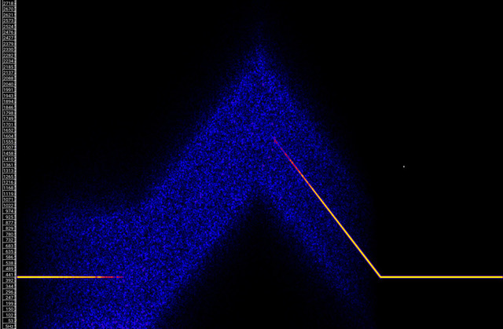

# beosc

## Abstract

Band-Enhanced Oscillator


## Description

Band-Enhanced oscillator, a port of Loris' oscillator (based on
Supercollider's BEOsc). The band-enhanced family of opcodes (beosc,
[beadsynt](beadsynt.md)) implement sound modelling and synthesis that
preserves the elegance and malleability of a sinusoidal model, while
accommodating sounds with noisy (non-sinusoidal) components. Analysis
is done offline, with an enhanced McAulay-Quatieri (MQ) style analysis
that extracts bandwidth information in addition to the sinusoidal
parameters for each partial. To produce noisy components, we
synthesise with sine wave oscillators that have been modified to allow
the introduction of variable bandwidth.

## Syntax


```csound

aout beosc xfreq, kbw, ifn=-1, iphs=0, inoisetype=1


```
    
## Arguments

* **xfreq**: The frequency of the oscillator (k or a rate)
* **kbw**: The bandwidth ("noisyness") of the oscillator 
* **ifn**: A table holding the waveform of the oscillator (default=-1,
  the builtin sine waveform)
* **iphs**: The phase of the sine (default=0)
* **inoisetype**: 0: uniform, 1: Gaussian (default=1)

## Output

* **aout**: The generated sound


## Execution Time

* Performance

## Examples



```csound
<CsoundSynthesizer>
<CsOptions>
-odac 
</CsOptions>
<CsInstruments>


sr = 44100
ksmps = 64
nchnls = 1
0dbfs  = 1

instr 1
  idur1 = 8
  ifreq = 440
  kfreq linseg ifreq, idur1, ifreq, idur1, ifreq*4, idur1, ifreq
  kbw   cosseg     0, idur1, 1,     idur1, 1,       idur1, 0
  ;          freq   bw   fn  phs              noisetype(0=uniform)
  aout  beosc kfreq, kbw, -1, unirand:i(6.28), 0
  aenv  linsegr 0, 0.1, 1, 0.1, 1, 0.1, 0
  aout *= (aenv * 0.2)
  outch 1, aout
endin

</CsInstruments>
<CsScore>
i 1 0 32
</CsScore>
</CsoundSynthesizer> 

```


## See also

* [beadsynt](beadsynt.md)
* [adsynt2](http://www.csound.com/docs/manual/adsynt2.html)
* [oscili](http://www.csound.com/docs/manual/oscili.html)

## Credits

Eduardo Moguillansky, 2019
